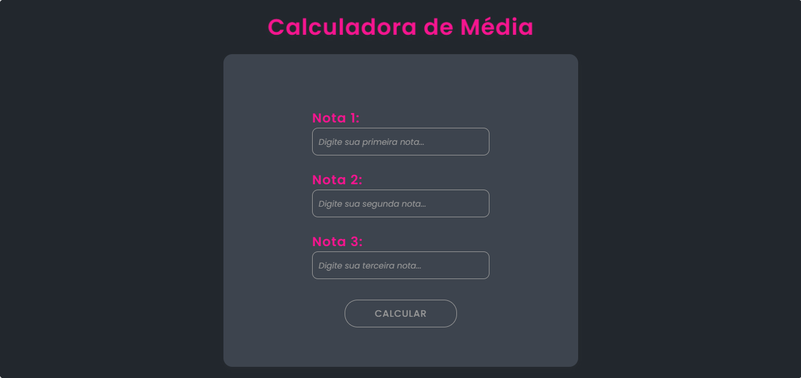
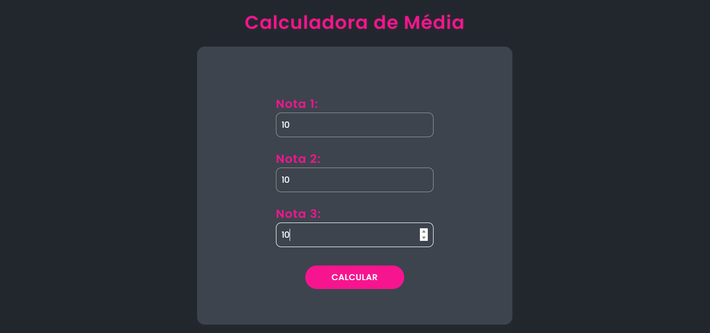

# 📊 Calculadora de Média de Notas

Bem-vindo ao projeto de **Calculadora de Média de Notas**! Este aplicativo permite que alunos calculem suas médias de notas para o semestre de forma simples e eficiente. Desenvolvido em Java com Servlets, HTML e CSS, oferece uma interface web intuitiva e funcional.

## 🚀 Funcionalidades

- **Cálculo de Média**: Insira suas notas e obtenha a média ponderada instantaneamente.
- **Interface Web**: Design responsivo usando HTML e CSS.
- **Backend em Java**: Utiliza Servlets para processar os dados e cálculos.

## 💻 Tecnologias Utilizadas

- **Java**: Linguagem de programação para o backend.
- **Servlets**: Manipulação de solicitações e lógica de backend.
- **HTML**: Estruturação do conteúdo da interface web.
- **CSS**: Estilização da interface para uma melhor experiência do usuário.

## 🛠️ Como Usar

1. **Clone o Repositório**:
   ```bash
   git clone https://github.com/PedroSampaio11/CalculatorJava.git
   

 📸 Imagens   
 




🤝 Contribuição
Contribuições são bem-vindas! Se você deseja contribuir para este projeto, siga estas etapas:

Faça um fork do repositório.
Crie uma nova branch (git checkout -b minha-nova-funcionalidade).
Faça suas alterações e commit (git commit -am 'Adiciona nova funcionalidade').
Faça um push para a branch (git push origin minha-nova-funcionalidade).
Crie um Pull Request.
📝 Licença
Este projeto está licenciado sob a Licença MIT. Veja o arquivo LICENSE para mais detalhes.

📬 Contato
Se você tiver dúvidas ou sugestões, entre em contato:

Nome: Pedro Sampaio
E-mail: pedrosampaio11@icloud.com
GitHub: PedroSampaio11
Obrigado por visitar o repositório! 🎉
